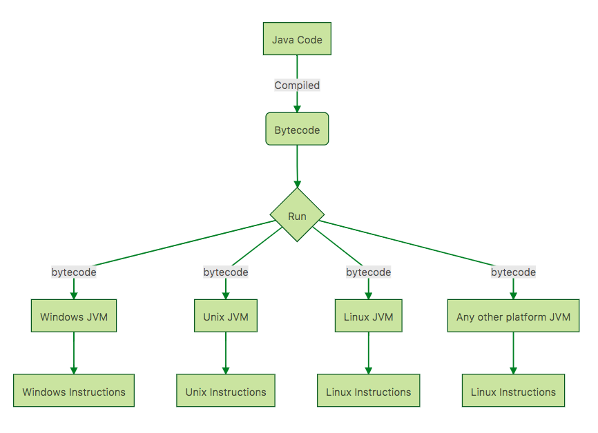

# Java Cheat Sheet
Review Java 9 Concepts at Jet Speed.

## Introduction

## Background

### Popularity of Java
- Platform Independent or Portable
- Object Oriented Language
- Security 
- Rich API
- Great IDE's
- Omnipresent 
   - Web Applications (JSP, Servlets, Spring, Struts..)
   - Mobile Apps(Android) 
   - Microservices (Spring Boot)

### Platform Independence
- Build once, run anywhere

- Java bytecode is the instruction set of the Java virtual machine


```
graph TD
A[Java Code] -->|Compiled| B(Bytecode)
B --> C{Run}
C -->|bytecode| D[Windows JVM] 
D --> K[Windows Instructions]
C -->|bytecode| E[Unix  JVM]
E --> L[Unix Instructions]
C -->|bytecode| F[Linux  JVM]
F --> M[Linux Instructions]
C -->|bytecode| G[Any other platform  JVM]
G --> N[Linux Instructions]
```

### JDK vs JVM VS JRE

- JVM (Java Virtual Machine)
  - runs the Java bytecode.
- JRE
  - JVM + Libraries + Other Components (to run applets and other java applications)
- JDK
  • JRE + Compilers + Debuggers

### ClassLoader

- Find and Loads Java Classes!

Three Types
- System Class Loader - Loads all application classes from CLASSPATH
- Extension Class Loader - Loads all classes from extension directory
- Bootstrap Class Loader - Loads all the Java core files

JVM needs to find a class, it starts with System Class Loader. If it is not found, it checks with Extension Class Loader. If it not found, it goes to the Bootstrap Class Loader. If a class is still not found, a ClassNotFoundException is thrown.


